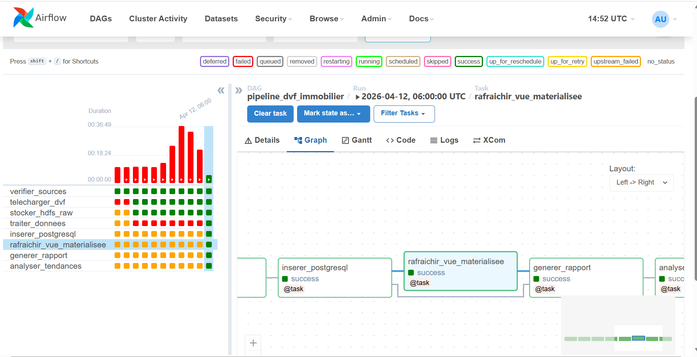

# Capture d'écran

## Exercice 1 — Question : TriggerRule pour `generer_rapport`

Pour que `generer_rapport` s'exécute même si `controler_qualite` lève une `ValueError`, il faut utiliser `TriggerRule.ALL_DONE` (ou `"all_done"`).

`ALL_DONE` garantit que `generer_rapport` tourne toujours, même si le contrôle qualité lève une exception (statut `failed`). Cela permet d'afficher un rapport partiel avec les données qui ont passé le filtre.

## Exercice 2 — Questions sur le partitionnement HDFS

### Pourquoi cette structure est-elle compatible avec Apache Spark et Hive ?

La structure Hive-style utilise une convention de
nommage que Spark et Hive reconnaissent nativement via leur moteur de partition pruning :
 
- Hive : lors d'un `SELECT … WHERE annee=2023 AND dept=75`, Hive lit
  uniquement les fichiers dans la partition correspondante. Il n'ouvre pas
  les autres répertoires.
- Spark : `spark.read.parquet("/dvf/raw/")` infère automatiquement le
  schéma de partition et crée des colonnes `annee` et `dept` dans le
  DataFrame, sans les lire physiquement dans les fichiers.

### Quel format serait encore plus optimal que CSV ?

Parquet est plus optimal car :
- Le pipeline ne lit que quelques colonnes (`valeur_fonciere`, `surface`,
   `code_postal`) sur les ~40 du CSV → gain massif en lecture colonnaire.
- Les statistics de pages permettent au moteur de sauter des blocs entiers sans les décompresser (predicate pushdown).
- C'est le format natif de Spark, Delta Lake et Apache Iceberg.

## Exercice 3 — Question : VIEW vs MATERIALIZED VIEW

### Différences fondamentales

| Critère               | VIEW                              | MATERIALIZED VIEW                    |
|-----------------------|-----------------------------------|--------------------------------------|
| Stockage physique     | Aucun (requête virtuelle)         |  Résultats stockés sur disque        |
| Fraîcheur des données | Toujours à jour (temps réel)      |  Stale jusqu'au prochain REFRESH     |
| Performance           | Recalcule à chaque SELECT         |  Lecture directe (comme une table)   |
| Index possibles       | Non                               |  (CREATE INDEX ON matview)           |
| REFRESH nécessaire    | Non                               |  Oui (manuel ou via trigger/Airflow) |
| Cas d'usage typique   | Simplifier une requête complexe   |  Pré-calculer des agrégats coûteux   |

### Quand choisir l'un ou l'autre ?

on utilise VIEW quand :
- Les données changent très fréquemment (stock en temps réel, IoT).
- La requête est simple et rapide (< 1 seconde).
- On n'a pas le droit d'avoir des données légèrement obsolètes.
- On veut juste masquer la complexité SQL à l'utilisateur final.

On utilise MATERIALIZED VIEW quand :
- La requête agrège des millions de lignes (comme notre pipeline DVF).
- Les données sont rafraîchies à intervalle connu (ici : daily via Airflow).
- On veut des temps de réponse < 100 ms pour un dashboard (BI, Grafana).
- On peut tolérer un léger décalage temporel (1 jour dans notre cas).

