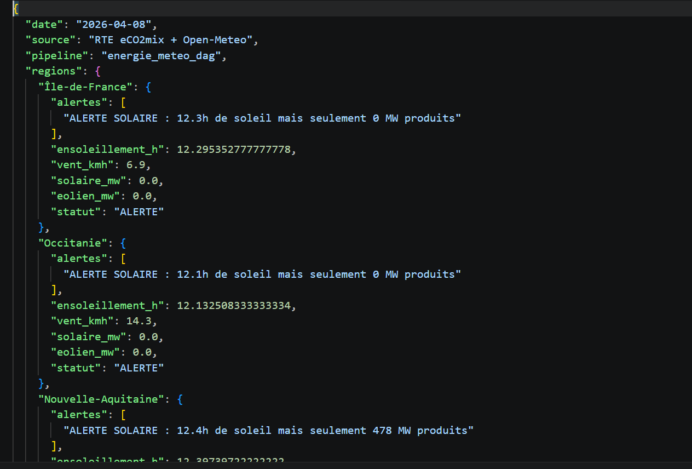

## Q1 — Docker Executor

Dans Airflow, il existe plusieurs types d’executors qui déterminent la manière dont les tâches sont exécutées. Le **LocalExecutor** exécute les tâches en parallèle directement sur une seule machine en utilisant plusieurs processus. Il est relativement simple à mettre en place, mais il reste limité par les ressources de la machine hôte. Il est adapté pour des environnements de développement ou de tests, ou pour des pipelines de petite taille ne nécessitant pas une forte scalabilité.

Le **CeleryExecutor**, quant à lui, permet de distribuer les tâches sur plusieurs workers grâce à un broker de messages comme Redis ou RabbitMQ. Cela permet de répartir la charge sur plusieurs machines et donc d’augmenter la capacité de traitement. Il est plus complexe à configurer mais beaucoup plus adapté à un environnement de production avec des volumes de données importants. Dans un contexte comme celui de RTE, il serait pertinent pour des pipelines nécessitant du parallélisme et une exécution distribuée.

Enfin, le **KubernetesExecutor** repose sur Kubernetes pour lancer chaque tâche dans un pod dédié. Cela permet une scalabilité très élevée ainsi qu’une isolation forte des tâches. Ce type d’executor est particulièrement adapté aux environnements cloud ou hybrides où les ressources sont allouées dynamiquement. Pour RTE, il serait intéressant dans le cas de traitements massifs ou de pics de charge importants.

En résumé, le LocalExecutor est limité mais simple, le CeleryExecutor offre un bon compromis entre complexité et scalabilité, et le KubernetesExecutor est le plus scalable mais aussi le plus complexe à mettre en œuvre.

## Q2 — Volumes Docker et persistance des DAGs

Le mapping `./dags:/opt/airflow/dags` correspond à un **bind mount**. Cela signifie que le dossier local `./dags` de la machine hôte est directement monté dans le conteneur Docker au chemin `/opt/airflow/dags`. Ainsi, toute modification effectuée sur les fichiers DAGs sur la machine hôte est immédiatement visible dans le conteneur, sans nécessiter de redémarrage.

Contrairement à cela, un volume nommé est géré directement par Docker et stocké dans une zone interne. Il est moins transparent mais permet une meilleure gestion des données par Docker.

Si ce mapping est supprimé, les DAGs doivent être inclus directement dans l’image Docker. Dans ce cas, toute modification d’un DAG nécessiterait de reconstruire l’image et de redéployer les conteneurs, ce qui ralentit fortement le développement et les mises à jour.

En production, dans un environnement Airflow distribué avec plusieurs workers, l’absence de mécanisme de partage des DAGs peut entraîner des incohérences entre les nœuds. Il est donc nécessaire d’utiliser une solution de stockage partagé ou un processus de déploiement synchronisé pour garantir que tous les workers disposent de la même version des DAGs.

## Q3 — Idempotence et catchup

Si le paramètre `catchup` est activé (`catchup=True`), Airflow va exécuter toutes les instances de DAG manquées depuis la `start_date` jusqu’à la date actuelle, selon la fréquence de planification. Par exemple, si le DAG est quotidien avec un `start_date` au 1er janvier 2024, alors Airflow va créer et exécuter toutes les tâches journalières non exécutées depuis cette date jusqu’à aujourd’hui.

L’idempotence d’un DAG signifie que son exécution multiple avec les mêmes données produit toujours le même résultat, sans effets de bord ni duplication de données. Cette propriété est essentielle dans un pipeline de données, car Airflow peut relancer des tâches en cas d’échec ou rejouer des exécutions via le catchup.

Dans un contexte énergétique comme celui de RTE, l’idempotence est critique car les données sont utilisées pour des analyses et des prises de décision. Sans idempotence, on pourrait introduire des doublons ou des incohérences dans les résultats.

Pour rendre les fonctions `collecter_*` idempotentes, il faut gérer les données de manière déterministe, par exemple en évitant les doublons, en utilisant des clés uniques (comme la date et la région), en écrasant les données existantes plutôt qu’en les ajoutant, et en validant les données avant insertion.

## Q4 — Timezone et données temps réel

Le paramètre `timezone=Europe/Paris` est essentiel car les données de l’API éCO2mix sont liées à des horaires locaux. En spécifiant explicitement le fuseau horaire, il faut que les données récupérées soient cohérentes avec l’heure locale utilisée par RTE. Cela évite les problèmes liés aux décalages entre UTC et l’heure locale.

Lors du passage à l’heure d’été (suppression d’une heure dans la journée), si la gestion des timezones n’est pas correctement configurée dans Airflow ou dans les appels API, cela peut entraîner des décalages dans les horaires des tâches ou des données manquantes.

Par exemple, une heure comme 2h du matin n’existe pas ce jour-là. Si un pipeline attend des données pour chaque heure, il peut manquer une valeur ou produire des séries temporelles incorrectes. Cela peut également entraîner des erreurs dans les agrégations ou des incohérences entre les données météo et les données de production.

Pour éviter ces problèmes, il est important de bien gérer les timezones dans Airflow, d’utiliser des timestamps en UTC en interne, et de convertir les données uniquement au moment de l’affichage ou de l’intégration avec des systèmes locaux.

##  Interface Airflow UI avec le DAG energie_meteo_dag visible et en état 
!(image-1.png)

##  Vue Graph du DAG montrant les 5 tâches et leurs dépendances
!(image-2.png)

##  Logs d’une exécution réussie de success generer_rapport_energie avec le tableau affiché
![(image-3.png)

## Onglet XCom de la tâche analyser_correlation montrant le dictionnaire d’alertes
!(image-4.png)

## Contenu du fichier JSON généré (via docker compose exec ... cat /tmp/rapport_energie_*.json)

## Exercices Supplémentaires
## EXO1
Le paramètre sla correspond à un objectif de temps de fin d’exécution par rapport au start_date du DAG. Si ce délai est dépassé, Airflow enregistre un SLA miss, mais cela n’interrompt pas la tâche.

En revanche, execution_timeout définit une limite stricte sur la durée d’exécution d’une tâche. Si cette durée est dépassée, la tâche est automatiquement arrêtée et marquée comme échouée.

Ainsi, sla est un mécanisme de monitoring et d’alerte, tandis que execution_timeout est un mécanisme de contrôle strict de l’exécution.

Un SLA miss n’arrête pas la tâche car il est conçu comme un outil de supervision et non comme un mécanisme de contrôle. L’objectif est de signaler qu’une tâche dépasse le délai attendu, sans perturber son exécution.

