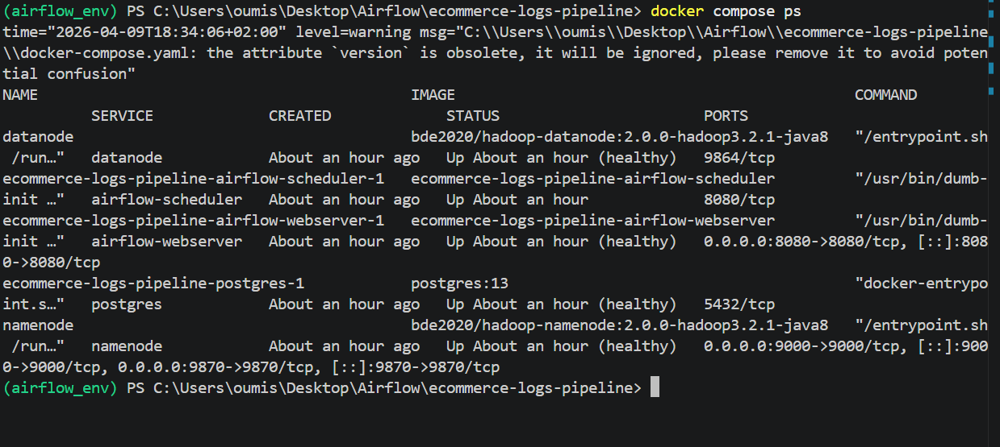
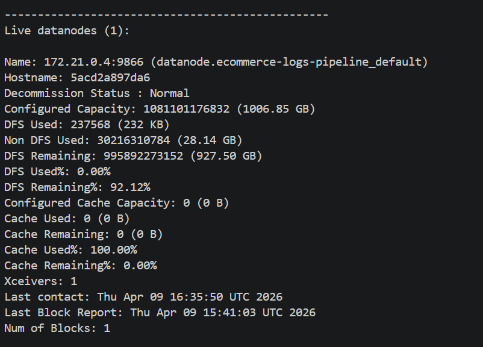
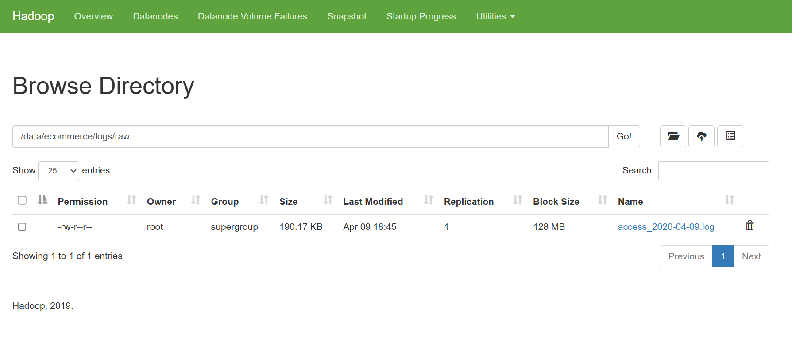
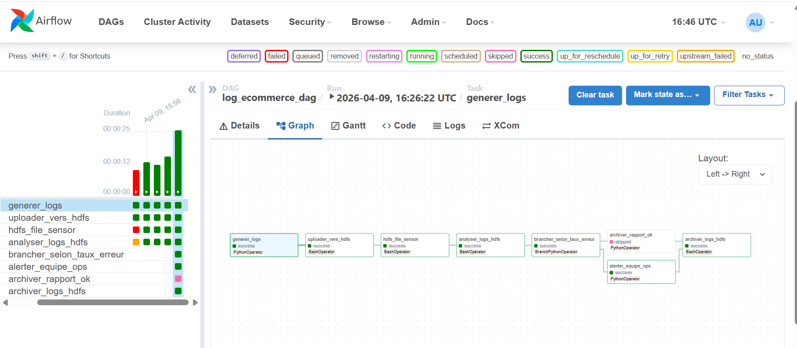
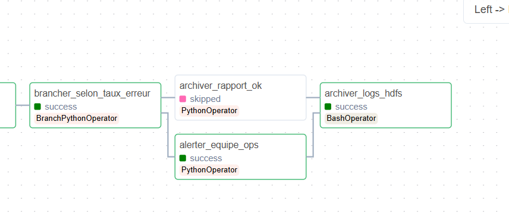
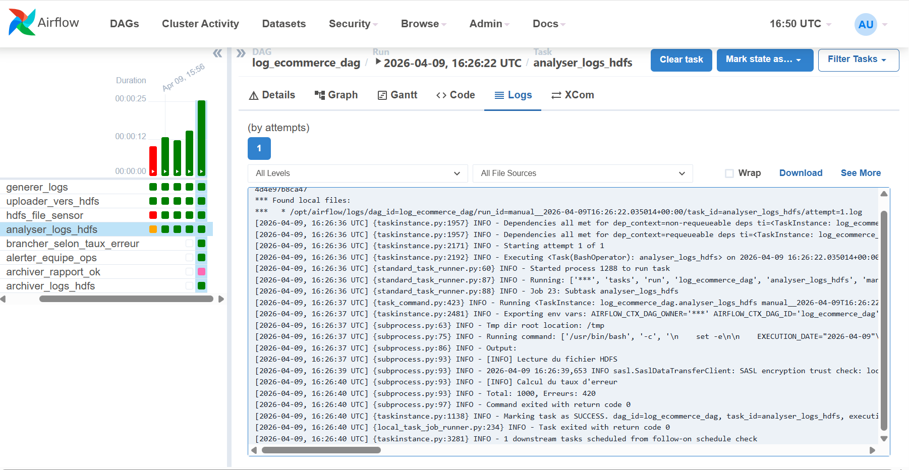
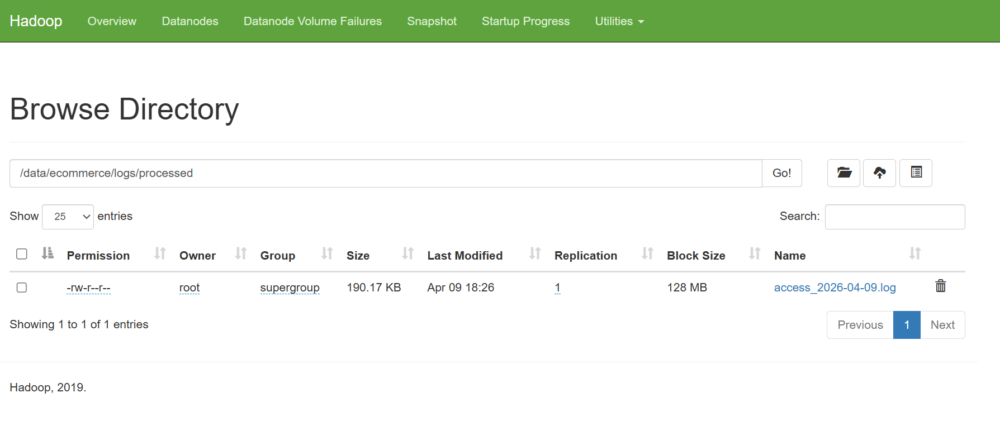

## Q1 — HDFS vs système de fichiers local

On ne stocke pas les logs sur un disque local ou un NFS car ces solutions ne sont pas adaptées à de gros volumes comme 50 Go par jour.

HDFS présente plusieurs avantages.
Tout d’abord, il est distribué : les données sont réparties sur plusieurs machines, ce qui permet de gérer de grands volumes sans limite de stockage d’un seul serveur.

Ensuite, HDFS propose de la réplication : chaque donnée est copiée sur plusieurs nœuds, ce qui permet de ne pas perdre les données en cas de panne.

Enfin, HDFS permet la localité des données : les traitements peuvent être exécutés directement là où les données sont stockées, ce qui améliore les performances et réduit le trafic réseau.

## Q2 — NameNode, point de défaillance unique (SPOF)

Le NameNode est un composant critique de HDFS. S’il tombe en panne, les DataNodes continuent de stocker les données, mais ils ne peuvent plus être coordonnés. Les clients ne peuvent plus lire ni écrire car ils ont besoin du NameNode pour localiser les fichiers.

Pour éviter ce problème, Hadoop propose une architecture haute disponibilité (HA). Elle repose sur deux NameNodes : un actif et un standby. Si le NameNode actif tombe, le standby prend automatiquement le relais.

Les JournalNodes jouent un rôle important dans cette architecture. Ils enregistrent les modifications des métadonnées du NameNode actif afin que le standby reste synchronisé en temps réel et puisse reprendre rapidement en cas de panne.

## Q3 — HdfsSensor vs polling actif

Le HdfsSensor permet d’attendre qu’un fichier apparaisse dans HDFS.

En mode poke, le sensor vérifie régulièrement la présence du fichier en gardant un worker occupé pendant toute l’attente. Cela consomme des ressources.

En mode reschedule, le sensor libère le worker entre chaque vérification. La tâche est relancée plus tard, ce qui est plus efficace en termes de ressources.

On utilise poke pour des attentes courtes. On utilise reschedule pour des attentes longues ou imprévisibles.

Si on utilise le mode poke sur plusieurs sensors longs, tous les workers peuvent être occupés, ce qui peut bloquer le scheduler et empêcher d’autres tâches de s’exécuter.

## Q4 — Réplication HDFS et cohérence des données

Avec un facteur de réplication de 3, chaque bloc de données est copié sur trois DataNodes différents.

Lors de l’écriture d’un bloc (par exemple 128 Mo), les données sont envoyées en pipeline : elles passent d’un DataNode à un autre jusqu’à ce que les trois copies soient écrites.

HDFS garantit que les données sont cohérentes. Un fichier n’est considéré comme disponible qu’une fois l’écriture terminée. Pendant l’écriture, les lecteurs peuvent accéder aux blocs déjà écrits, mais le fichier complet n’est visible qu’après sa fermeture.

# 1 docker compose ps

# 2 

# 3 

# 4

# 5

# 6

# 7

# EXOS SUP 
# EXO1 
Q3 : Lors du test avec un fichier absent, la tâche HdfsFileSensor passe en statut up_for_reschedule. Cela signifie que le sensor libère le worker et sera relancé plus tard.

Q4 : Le poke garde le worker occupé, il est simple mais coûteux. Par contre, reschedule libère le worker entre les checks et est plus scalable.

Le mode reschedule est recommandé car il libère les workers pendant l’attente. Cela permet d’éviter de bloquer toutes les ressources Airflow si plusieurs sensors attendent longtemps.
En production, cela améliore fortement la scalabilité du système.

# EXO3
Q4 : La tâche passe en up_for_retry juste après une exception, quand Airflow capture l’erreur, et avant le prochain retry.

Question de réflexion : Si la tâche est critique (SLA élevé), je vais choisir :
- retries élevé (ex: 5 à 10)
- retry_delay court (ex: 30s)
- retry_exponential_backoff=True
- execution_timeout (ex: 10 min)
Parceque retries augmente chances de succès, backoff évite surcharger HDFS, et timeout évite blocage infini
